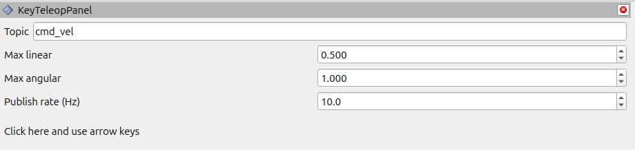
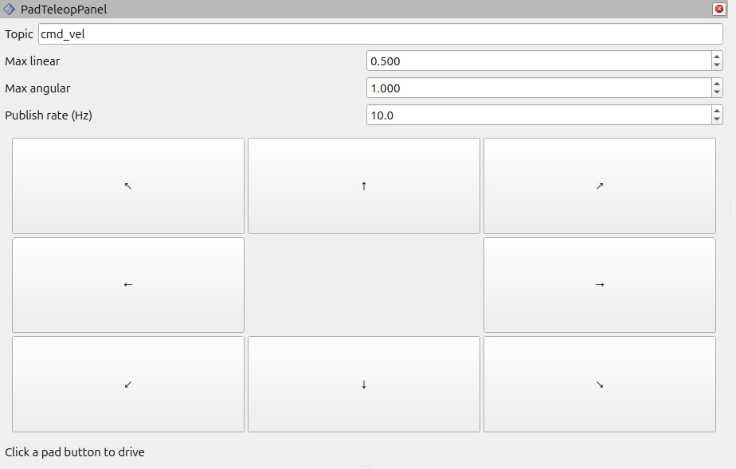
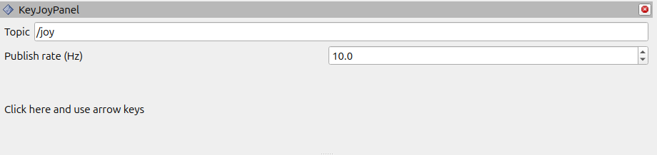
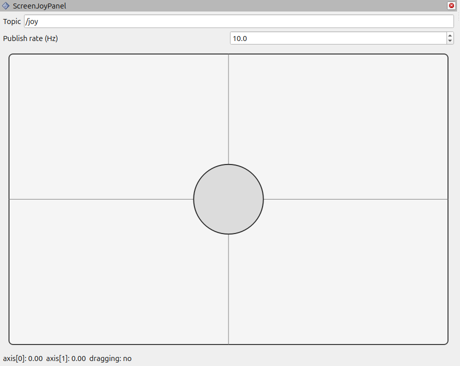

# rviz2_teleop_plugin

RViz2 panel plugins for teleoperation. The package provides four panels for keyboard, on-screen pad, and joystick-style inputs. Each panel publishes to a ROS 2 topic at a configurable rate.

## Features

- **Key Teleop**: Publish `geometry_msgs/Twist` from arrow keys.
- **Pad Teleop**: Click a 3x3 directional pad to publish `geometry_msgs/Twist`.
- **Key Joy**: Publish `sensor_msgs/Joy` axes from arrow keys.
- **Screen Joy**: Drag an on-screen joystick to publish `sensor_msgs/Joy` axes.

## Panels

### Key Teleop Panel

Click inside the panel to focus, then use the arrow keys. Adjust max linear/angular and publish rate as needed.



### Pad Teleop Panel

Click a directional button (including diagonals). The command stops when you release the button.



### Key Joy Panel

Click inside the panel to focus, then use the arrow keys. Axes are normalized to `[-1.0, 1.0]`.



### Screen Joy Panel

Drag the knob to publish joystick axes. Axes are normalized to `[-1.0, 1.0]`.



## Topics and defaults

- **Key Teleop / Pad Teleop**
  - Message: `geometry_msgs/Twist`
  - Default topic: `cmd_vel`
  - Configurable: max linear, max angular, publish rate
- **Key Joy / Screen Joy**
  - Message: `sensor_msgs/Joy`
  - Default topic: `/joy`
  - Configurable: publish rate

## Build

From your ROS 2 workspace:

```bash
colcon build --packages-select rviz2_teleop_plugin
```

Then source the workspace:

```bash
source install/setup.bash
```

## Use in RViz2

1. Launch RViz2:
   ```bash
   rviz2
   ```
2. Add a panel: `Panels` → `Add New Panel...`
3. Select one of:
   - `rviz2_teleop_plugin/KeyTeleopPanel`
   - `rviz2_teleop_plugin/PadTeleopPanel`
   - `rviz2_teleop_plugin/KeyJoyPanel`
   - `rviz2_teleop_plugin/ScreenJoyPanel`
4. Click inside the panel (if needed) and teleoperate :) 
